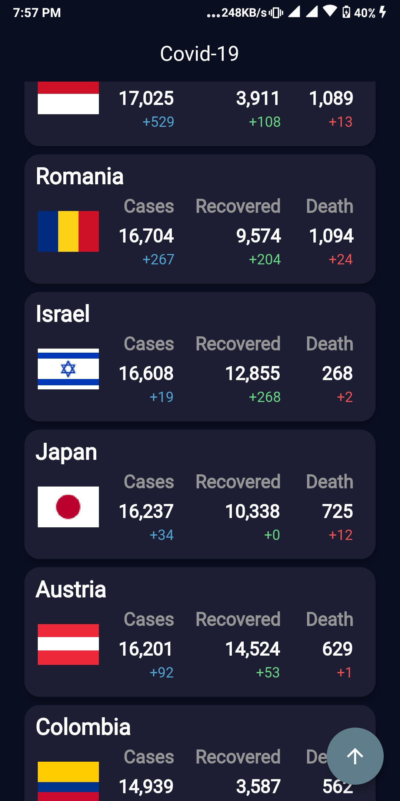
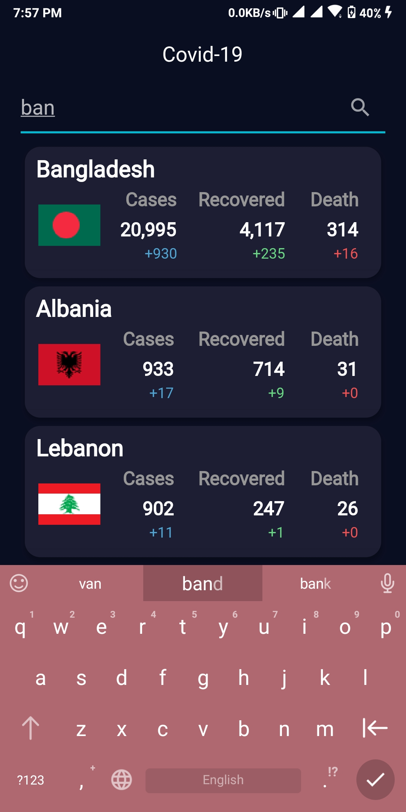

# COVID-19 Statistics Dashboard

A comprehensive Flutter application that provides real-time COVID-19 statistics and visualizations, helping users stay informed about the global pandemic situation.






## Features

- Real-time global COVID-19 statistics
- Country-wise detailed information
- Interactive charts and visualizations
- Offline data persistence
- Clean and intuitive user interface
- Responsive design for various screen sizes

## Technical Stack

- **Framework:** Flutter
- **State Management:** Scoped Model
- **API Integration:** Dio
- **Charts:** fl_chart
- **Dependency Injection:** get_it
- **Data Models:** JSON Serialization
- **Network Connectivity:** connectivity

## Prerequisites

- Flutter SDK (>=2.2.2)
- Dart SDK
- Android Studio / VS Code
- Android SDK / Xcode (for iOS development)

## Installation

1. Clone the repository:
   ```bash
   git clone https://github.com/yourusername/COVID-Statistics.git
   ```

2. Navigate to the project directory:
   ```bash
   cd COVID-Statistics
   ```

3. Install dependencies:
   ```bash
   flutter pub get
   ```

4. Run the app:
   ```bash
   flutter run
   ```

## Project Structure

```
lib/
├── charts/          # Chart widgets and data
├── enum/            # Enumerations
├── model/           # Data models
├── scoped_model/    # State management
├── service/         # API services
├── shared/          # Shared components
├── utils/           # Utility functions
└── view/            # UI screens and widgets
```

## Features in Detail

### Real-time Data
The application fetches the latest COVID-19 statistics using a reliable API service, ensuring users have access to up-to-date information.

### Interactive Visualizations
Utilizes `fl_chart` to create interactive and informative visualizations of COVID-19 data, making it easier to understand trends and patterns.

### Offline Support
Implements data persistence to allow users to access previously loaded statistics even without an internet connection.

### Responsive Design
Built with Flutter's widget system to ensure a consistent and appealing user experience across different device sizes and orientations.

## Contributing

1. Fork the repository
2. Create your feature branch (`git checkout -b feature/amazing-feature`)
3. Commit your changes (`git commit -m 'Add some amazing feature'`)
4. Push to the branch (`git push origin feature/amazing-feature`)
5. Open a Pull Request

## License

This project is licensed under the MIT License - see the [LICENSE](LICENSE) file for details.

## Acknowledgments

- Data provided by COVID-19 API
- Flutter and the Flutter team for the amazing framework
- All contributors who help improve this project

---

For issues, feature requests, or contributions, please file an issue in the GitHub repository.
